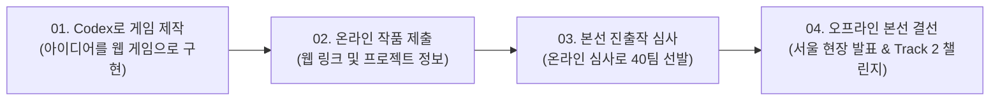

# OpenAI Game Builders Seoul 개요

## 1. 행사 소개

**OpenAI Game Builders Seoul**은 오픈AI(OpenAI)와 컴투스홀딩스(Com2uS Holdings)가 공동 주최·주관하는 AI 기반 게임 개발 해커톤입니다. 

자연어로 소프트웨어 개발 전반을 지원하는 오픈AI의 코딩 에이전트 **Codex**와, 글로벌 게임 백엔드 서비스 플랫폼인 **Hive**를 결합하여, 참가자들이 아이디어를 즉시 플레이 가능한 웹 게임으로 구현하고 글로벌 라이브 서비스 레벨로 확장하는 차세대 게임 개발 워크플로우를 실험합니다.

```
"Build with Codex, Play with Hive."
(Codex로 만들고, Hive와 글로벌 무대로)
```

---

## 2. 행사의 핵심 비전 및 취지

### AI와 Game의 만남
게임 산업은 새로운 첨단 기술의 도입과 이로 인한 창작 방식의 패러다임 전환이 가장 빠르고 역동적으로 일어나는 영역입니다. 생성형 AI가 게임 개발의 문턱을 낮추고 창작 속도를 비약적으로 높이는 시점에서, 본 행사는 참가자가 AI 코딩 에이전트 Codex를 활용해 **AI 네이티브 개발 워크플로우**를 직접 경험하고 공유하는 장을 마련합니다.

### Why Seoul? (왜 서울인가?)
첫 번째 Game Builders의 무대로 대한민국 서울이 선정된 이유는 다음과 같습니다:
1. **세계 최고 수준의 게임 개발 역량**: 한국은 초기 온라인 게임부터 MMORPG, 모바일 게임 및 글로벌 라이브 서비스까지 세계적 경쟁력을 갖춘 개발 생태계를 보유하고 있습니다.
2. **깊이 있는 게임 문화와 강력한 커뮤니티**: 게임을 일상 속에서 즐기고 커뮤니티와 함께 성장시켜 온 유저 및 개발자 층이 매우 두텁습니다.
3. **기술과 빌더의 만남**: 새로운 기술(AI)의 진정한 잠재력은 기술 그 자체에 머무르지 않고, 이를 적극적으로 활용하여 예상치 못한 방식으로 확장하는 창의적인 빌더들을 만났을 때 비로소 발현됩니다.

---

## 3. 핵심 진행 흐름 (How It Works)



1. **Step 01. Codex로 게임 만들기 (From zero to one)**:
   - 자연어를 활용해 Codex와 협업하여 아이디어를 브라우저에서 실행 가능한 플레이어블 게임 프로토타입으로 완성합니다.
2. **Step 02. 온라인 작품 제출 (Submit)**:
   - 완성된 웹 게임 링크와 함께 썸네일, 게임 소개, Codex 활용 설명(선택) 등을 온라인으로 제출합니다.
3. **Step 03. 본선 40팀 선발 (40 Finalists)**:
   - 5대 공통 심사 기준(Playability, Originality, Codex Collaboration, Release Potential, Presentation)을 통해 우수한 40개 팀을 선발합니다.
4. **Step 04. 서울 오프라인 본선 참가 (In-Person Event)**:
   - 선발된 팀의 대표 1인이 2026년 8월 31일 서울 현장 행사에 초청되어, 한국 게임 레전드들 앞에서 작품을 발표·시연하고 현장 5시간 해커톤(Track 2)에 도전합니다.

---

## 4. 주최, 주관 및 파트너

| 구분 | 기업 / 기관 | 역할 및 협력 내용 |
| :--- | :--- | :--- |
| **주최 (Host)** | **OpenAI OpCo, L.L.C.** | 해커톤 기획 및 총괄, 기술 지원(Codex API), 총 $50,000+ OpenAI 크레딧 및 ChatGPT Pro 구독권 리워드 제공 |
| **주관 (Organizer)** | **㈜컴투스홀딩스 (Com2uS Holdings)** | 행사 기획 및 운영 총괄, 참가자 관리, 심사 및 오프라인 행사 진행, 홍보 |
| **플랫폼 파트너** | **Com2uS Hive (하이브)** | 게임 백엔드 서비스 플랫폼(인증, 결제, 분석, 보안 등) 제공 및 출시 잠재력 평가 |

---

## 5. 기본 참가 요건

- **참가 자격**: 누구나 참여 가능한 열린 글로벌 해커톤 (국내외 개인 또는 팀)
- **팀 구성**: 팀당 최대 3인 이하
- **본선 참석**: 팀 단위 참가 시 오프라인 본선(8/31)에는 팀 대표자 1인만 참석 가능 (부득이한 경우 사전 승인된 팀원 1인 대리 참석 가능)
- **제출 형식**: 브라우저에서 별도 설치 없이 바로 실행 가능한 웹 빌드(Web Build) 형태 필수
- **연령 규정**: 아동/청소년 참가자의 경우 거주 국가 기준에 따라 법정대리인 동의 필수
