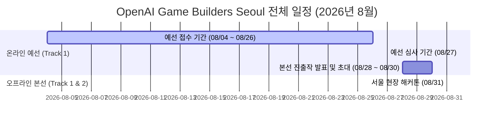

# 전체 일정 및 상세 타임테이블 (Schedule & Timeline)

OpenAI Game Builders Seoul의 전체 일정과 8월 31일 서울 현장 본선 행사의 상세 타임테이블입니다.

---

## 1. 전체 마일스톤 일정



### 상세 일정 요약

| 단계 | 기간 | 내용 | 비고 |
| :--- | :--- | :--- | :--- |
| **01. 예선 접수 기간** | **2026.08.04(화) ~ 08.26(수)** | Track 1 오픈 및 온라인 접수 페이지를 통해 웹 게임 제출 | 마감: 2026-08-27 00:00 KST |
| **02. 예선 심사 기간** | **2026.08.27(목)** | 제출작 대상 온라인 심사 진행, 본선 진출 **40팀** 선발 | 5대 심사 기준 적용 |
| **03. 본선 진출작 발표** | **2026.08.28(금) ~ 08.30(일)** | 40개 본선 진출팀 대상 One Day Hackathon 초대 개별 연락 | 팀 대표 1인 참가 안내 |
| **04. 오프라인 본선 결선** | **2026.08.31(월)** | 서울 현장 행사 개최 (오프닝, 개발자 만남, Track 2 챌린지, 피칭, 시상) | 종일 오프라인 진행 |

---

## 2. 8월 31일(월) 오프라인 본선 상세 타임테이블

> **장소**: 대한민국 서울 (Seoul, South Korea - 상세 장소는 본선 진출팀 대상 개별 안내)  
> **대상**: 본선 진출 40개 팀 대표 1인 및 심사위원, 초청 게스트

```mermaid
timeline
    title 2026년 8월 31일(월) One Day Hackathon 타임테이블
    09:00 : 입장 시작 및 등록
    09:30 : 오프닝 키노트
    10:30 : 한국 레전드 게임 개발자와의 만남 (좌담회/세션)
    11:20 : Track 2 현장 5시간 해커톤 시작 (주제 현장 공개)
    13:00 : Track 1 본선 진출작 Open-Mic 피칭 개시 (최대 3분)
    18:00 : 시상식 및 폐회 (현장 투표 마감, Track 1 & 2 Winner 발표)
```

### 프로그램 세부 안내

| 시간 | 프로그램명 | 상세 내용 |
| :--- | :--- | :--- |
| **09:00 ~ 09:30** | **입장 및 등록** | 참가자 본인 확인, 네임태그 수령, 작업 공간 배정 및 네트워크 연결 |
| **09:30 ~ 10:30** | **오프닝 키노트** | OpenAI & 컴투스 리더십 키노트<br>- AI 네이티브 개발 패러다임과 게임의 미래 비전 제시<br>- 해커톤 운영 규칙 및 안내 |
| **10:30 ~ 11:20** | **한국 레전드 게임 개발자와의 만남** | 국내 1세대 및 스타 개발자 12인과의 특별 세션<br>- MMORPG, 라이브 서비스, 모바일 혁신 경험과 AI 활용 인사이트 공유 |
| **11:20 ~ 16:20** | **Track 2: 5 Hour Build 개시** | **현장 해커톤 주제 공개**<br>- 제한 시간(5시간) 내 즉석에서 Codex로 브라우저 게임 개발 및 제출<br>- 현장 제출 완료 후 실시간 플레이 및 인기 투표 진행 |
| **13:00 ~ 17:30** | **Track 1: Open-Mic 개시** | **본선 진출자 엘리베이터 피치 (Elevator Pitch)**<br>- 온라인 예선을 뚫고 선발된 40팀의 릴레이 발표 (팀당 최대 3분)<br>- 형식: PPT 발표, 게임 데모 시연, PPT+시연 결합 등 자유 형식<br>- 심사위원단 및 참가자 대상 작품의 매력과 Codex 협업 과정 어필 |
| **18:00 ~** | **시상식 및 네트워킹** | - Track 2 현장 투표 마감<br>- **Track 1 최종 수상작 (대상, 최우수, 우수, 장려 5팀) 발표 및 시상**<br>- **Track 2 현장 투표 우수 3팀 시상**<br>- 기념 촬영 및 네트워킹 |

---

## 3. 참가자 유의사항

1. **시간 엄수**: 본선 현장 등록은 09:00부터 시작되며, 09:30 오프닝 키노트 전까지 입장을 완료해야 합니다.
2. **장비 지참**: Track 2(현장 5시간 빌드) 개발 및 Track 1 시연/피칭을 위해 개인 노트북 및 충전 어댑터를 반드시 지참해야 합니다.
3. **참석자 제한**: 공간 및 원활한 운영을 위해 팀당 **대표자 1인**만 입장이 가능합니다. (사전 협의 없는 동반인 입장 불가)
