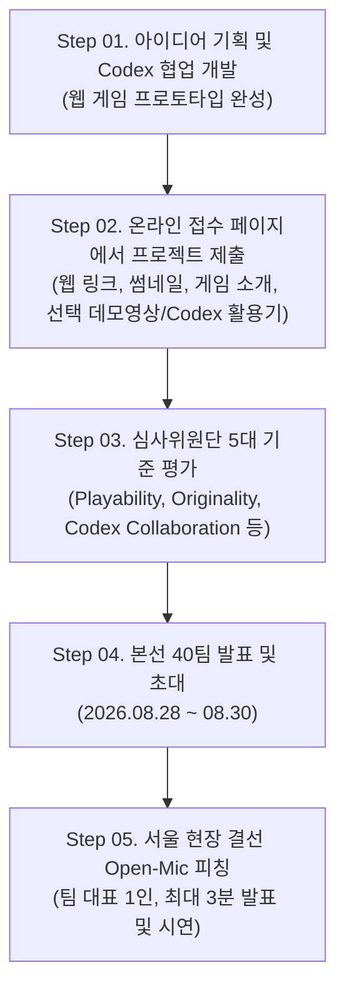

# Track 1: Online Warm-up Challenge

> **테마**: *"From zero to one: build with Codex"*  
> **부제**: 아이디어를 플레이 가능한 게임으로

Track 1은 사전 온라인 기간 동안 OpenAI의 코딩 에이전트 **Codex**를 활용하여 게임 아이디어를 실제로 플레이 가능한 웹 기반 프로토타입 게임으로 구현하고 제출하는 온라인 예선 트랙입니다.

---

## 1. 트랙 개요

- **진행 방식**: 온라인 접수 및 심사 → 서울 오프라인 본선 진출
- **접수 기간**: 2026.08.04(화) ~ 2026.08.26(수) (2026-08-27 00:00 KST 마감)
- **선발 규모**: 온라인 제출작 중 상위 **40개 팀** 선발
- **본선 혜택**: 서울 오프라인 One Day Hackathon 초대 + 참가자 전원 $100 OpenAI 크레딧 + 본선 피칭 기회 부여

---

## 2. 프로토타입 주요 필수 조건

Track 1에 제출하는 게임은 다음 3가지 핵심 요건을 만족해야 합니다.

```
┌───────────────────────┬───────────────────────┬───────────────────────┐
│   01. 재밌는 게임 코어  │   02. 제약 없는 플레이  │  03. 개발 시 Codex 활용 │
├───────────────────────┼───────────────────────┼───────────────────────┤
│ 코어 플레이 구조에서  │ 별도 설치나 로그인    │ 게임 기획/개발/디버깅 │
│ 즉각적인 재미와 몰입을│ 제약 없이 누구나 웹   │ 과정에 OpenAI Codex를 │
│ 느낄 수 있어야 함     │ 브라우저에서 실행 가능│ 적극 활용해야 함      │
└───────────────────────┴───────────────────────┴───────────────────────┘
```

1. **재밌는 게임 코어 (Core Fun Loop)**:
   - 게임의 핵심 메커니즘과 루프(Core Loop)가 명확하며, 조작과 규칙에서 즉각적인 재미를 전달할 수 있어야 합니다.
2. **제약 없는 웹 플레이 (Web-Based Playability)**:
   - 심사위원과 대중이 링크 클릭 즉시 브라우저에서 실행할 수 있는 웹 빌드(HTML5/WebGL/WebGPU/Canvas/Wasm 등) 형태여야 합니다.
   - 모바일 앱 설치 파일(APK/IPA), GitHub 소스코드 저장소 링크, 실행 불가 소개 페이지 등은 심사 대상에서 제외됩니다.
3. **개발 시 Codex 활용 (Built with Codex)**:
   - 게임 로직 작성, 알고리즘 구현, UI/UX 개발, 버그 수정 등 전반적인 개발 과정에 OpenAI Codex를 활용해야 합니다.

---

## 3. 진행 단계 (Step-by-Step)



---

## 4. 제출 항목 구성

| 항목 | 구분 | 상세 요구사항 |
| :--- | :---: | :--- |
| **플레이 가능한 게임 링크** | **필수** | 브라우저에서 바로 실행되는 웹 빌드 URL (`https://...`) |
| **게임 제목** | **필수** | 최대 80자 이내의 공식 게임 제목 |
| **게임 소개** | **필수** | 최대 200자 이내의 게임 핵심 콘셉트 및 설명 |
| **게임 썸네일** | **필수** | 16:9 비율 권장, JPG/PNG 형식, 최대 10MB |
| **데모 영상 링크** | *선택(가산점)* | 3분 이내의 실제 플레이 영상 URL (게임소개/플레이/핵심기능) |
| **Codex 활용 설명** | *선택(가산점)* | 최대 5,000자 이내의 Codex 활용 과정, 구현 기능, 문제 해결기 |

---

## 5. 리워드 및 혜택 (Track 1 Winners)

Track 1 본선 진출작은 8월 31일 현장 심사 및 피칭을 거쳐 최종 수상팀이 결정됩니다.

| 상격 | 선발 규모 | 리워드 내용 |
| :--- | :---: | :--- |
| **대상 (Grand Prize)** | **1팀** | **$15,000 상당 OpenAI 크레딧** + **ChatGPT Pro 1년 구독권** |
| **최우수상 (First Prize)** | **1팀** | **$10,000 상당 OpenAI 크레딧** + **ChatGPT Pro 1년 구독권** |
| **우수상 (Second Prize)** | **1팀** | **$7,500 상당 OpenAI 크레딧** + **ChatGPT Pro 1년 구독권** |
| **장려상 (Excellence Prize)** | **5팀** | **각 $3,500 상당 OpenAI 크레딧** (총 $17,500) + **ChatGPT Pro 1년 구독권** |
| **본선 참가자 전원** | **40팀 전원** | **$100 상당 OpenAI 크레딧** |

> 💡 **참고**: 리워드는 팀당 대표자 1인이 수령합니다. 수상작의 경우 향후 게임 출시 시 Hive 연동이 권장될 수 있습니다.
