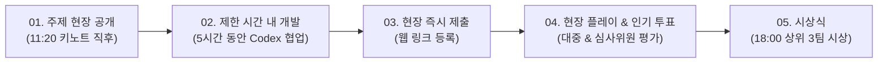

# Track 2: One Day Hackathon Challenge

> **테마**: *"Go full Codex: 5 hour build"*  
> **부제**: 현장 공개 주제를 몇 시간 만에 실제 게임으로

Track 2는 2026년 8월 31일(월) 서울 오프라인 본선 현장에서 열리는 즉석 해커톤 챌린지입니다. 행사 당일 현장에서 발표되는 주제에 맞춰, 제한된 5시간 동안 OpenAI Codex를 전면 활용하여 브라우저에서 바로 플레이할 수 있는 게임을 개발하고 현장 인기 투표를 통해 승자를 가립니다.

---

## 1. 트랙 개요

- **일시**: 2026년 8월 31일(월) 11:20 ~ 16:20 (약 5시간)
- **장소**: 서울 오프라인 본선 행사장
- **참가 자격**: **Track 1 온라인 예선을 통과한 본선 진출 40개 팀의 대표자 1인**
- **평가 방식**: 결과물 제출 후 행사 웹사이트 실시간 공개 및 **현장 참가자/심사위원 인기 투표**
- **시상**: 현장 인기 투표 상위 3팀

---

## 2. 현장 게임 개발 주요 조건

1. **주제 현장 공개 (Surprise Theme)**:
   - 개발 주제와 키워드는 행사 당일 오전 11시 20분에 현장에서 즉석 공개됩니다.
   - 제출하는 게임은 이 현장 공개 주제를 반드시 핵심 메커니즘이나 스토리에 반영해야 합니다.
2. **제한 시간 내 개발 (5 Hour Build)**:
   - 약 5시간이라는 극도로 압축된 시간 안에 아이디어 스케치부터 작동 가능한 웹 게임 빌드까지 완성해야 합니다.
   - 빠른 코드 생성, 인터랙션 설계, 디버깅을 위해 **OpenAI Codex를 최대로 활용**하는 것이 핵심 역량입니다.
3. **제약 없는 웹 빌드 제출 (Immediate Play)**:
   - 별도 설치 없이 브라우저에서 즉시 실행 가능한 URL로 당일 지정된 시스템에 제출합니다.
   - 로그인이나 결제 없이 즉시 플레이 가능해야 현장 투표에서 유저 경험을 온전히 전달할 수 있습니다.

---

## 3. 심사 및 투표 방식 (Voting & Evaluation)

- **공개 갤러리 전시**: 제출된 Track 2 게임은 해커톤 웹사이트의 라이브 갤러리에 실시간으로 등록됩니다.
- **현장 인기 투표**: 본선 행사에 참가한 모든 개발자, 게스트, 멘토, 심사위원이 직접 플레이해 보고 마음에 드는 작품에 투표를 진행합니다.
- **최종 수상작 결정**: 현장 투표 종료 후 상위 최다 득표 3개 팀이 Track 2 수상작으로 선정됩니다.

---

## 4. 리워드 및 혜택 (Track 2 Winners)

| 상격 | 선발 규모 | 리워드 내용 |
| :--- | :---: | :--- |
| **Track 2 상위 3팀 (Winner 3)** | **3팀** | **ChatGPT Pro 1년 구독권** (팀당 대표자 1인 수령) |

---

## 5. Track 2 전략 팁

1. **스코프(Scope) 최소화**: 5시간은 매우 짧으므로 복잡한 시스템보다는 하나의 명확하고 중독성 있는 코어 메커니즘에 집중하세요.
2. **Codex 프롬프트 최적화**: 게임 템플릿 세팅, 물리 연산, 키보드/터치 입력 제어, 게임오버 및 스코어보드 로직을 Codex에게 빠르고 명확하게 지시하세요.
3. **웹 그래픽/사운드 에셋 경량화**: Canvas, Three.js, Phaser, Kaboom.js 등 가벼운 웹 엔진을 활용하여 빠른 로딩과 부드러운 플레이를 확보하세요.
