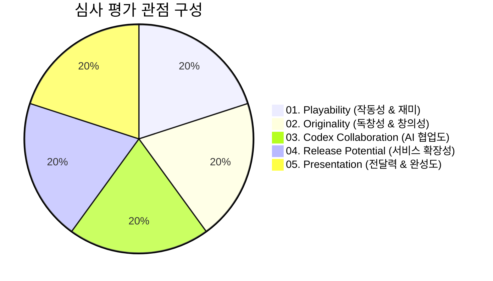

# 심사 기준 및 평가 방식 (Judging Criteria)

OpenAI Game Builders Seoul의 온라인 예선(40팀 선발) 및 최종 수상작 심사에 적용되는 5대 핵심 평가 기준과 심사위원단의 종합 평가 방식입니다.

---

## 1. 5대 핵심 심사 기준 개요

심사위원단은 특정 한 항목에 치우치지 않고, 아래 **5가지 기준을 종합적으로 반영**하여 완성도와 잠재력을 갖춘 작품을 선발합니다.



---

## 2. 세부 평가 항목별 해설

### 01. Playability (플레이 완성도 및 작동성)
> *"게임이 실제로 잘 작동하고, 충분히 즐길 수 있는가?"*

- **정상 실행 여부**: 웹 브라우저 접속 시 오류나 멈춤 없이 매끄럽게 로딩되고 실행되는가?
- **조작성과 반응성**: 사용자 입력(키보드, 마우스, 터치 등)에 즉각적이고 자연스럽게 반응하는가?
- **코어 루프(Core Loop)의 완성도**: 시작부터 목표 달성, 실패/재도전으로 이어지는 핵심 플레이 흐름이 잘 갖춰져 있는가?
- **순수한 재미(Fun Factor)**: 기술 데모에 그치지 않고, 플레이어에게 실질적인 몰입과 즐거움을 선사하는가?

---

### 02. Originality (독창성 및 참신성)
> *"아이디어와 플레이 방식이 독창적인가?"*

- **창의적 콘셉트**: 기존에 흔히 보던 게임의 단순 복제가 아닌, 새로운 시각과 독창적인 테마가 담겨 있는가?
- **차별화된 메커니즘**: 게임 규칙, 인터랙션, 진행 방식에서 참가자만의 고유한 발상이 드러나는가?
- **클리셰의 재해석**: 기존 유명 장르(퍼즐, 액션, 러너 등)를 채택했더라도, 독특한 반전이나 새로운 시스템으로 신선한 경험을 창출했는가?

---

### 03. Codex Collaboration (Codex 협업 및 AI 활용도)
> *"Codex를 효과적으로 활용하여 게임을 구현했는가?"*

- **구현 범위의 확장**: AI 코딩 에이전트(Codex)를 통해 혼자 또는 소규모 팀이 단기간에 만들기 어려운 복잡한 로직이나 기능을 구현해 냈는가?
- **효과적인 문제 해결**: 개발 중 마주친 기술적 한계나 버그, 수학적/물리적 연산 알고리즘을 Codex와의 대화 및 협업으로 스마트하게 풀어냈는가?
- **인간과 AI의 시너지**: AI에게 무비판적으로 의존한 것이 아니라, 인간 기획자의 의도와 AI의 코드 생성력이 조화롭게 융합되었는가?

---

### 04. Release Potential (서비스 확장 잠재력)
> *"Hive를 통해 실제 서비스로 확장할 수 있는가?"*

- **지속 가능성**: 1회성 미니 데모를 넘어, 지속적인 콘텐츠 업데이트나 레벨 확장이 가능한 구조인가?
- **글로벌 서비스 적합성**: 전 세계 유저를 대상으로 언어, 직관적 UI, 네트워크 환경을 고려한 설계인가?
- **플랫폼(Hive) 연동 친화성**: 계정 인증, 리더보드, 인앱 결제, 유저 데이터 분석, 소셜 기능 등 Com2uS Hive 백엔드 플랫폼과 연계하여 정식 런칭할 수 있는 잠재력을 갖추었는가?

---

### 05. Presentation (전달력 및 피칭)
> *"게임의 핵심 아이디어와 재미가 명확하게 전달되는가?"*

- **직관적 UX/UI**: 튜토리얼이나 장황한 설명서 없이도 게임플레이 안에서 목표와 조작법이 자연스럽게 이해되는가?
- **시각/청각적 연출**: 테마에 어울리는 아트 스타일, 애니메이션, 사운드 이펙트가 게임의 매력을 극대화하는가?
- **본선 엘리베이터 피치 (Onsite)**: 오프라인 본선 현장에서 3분이라는 짧은 시간 동안 심사위원과 관객에게 자신의 작품과 개발 철학을 매력적으로 어필하는가?

---

## 3. 심사 절차

```
[1단계: 예선 서류/빌드 심사 (8/27)]
  - 제출된 웹 링크 접속 테스트 및 5대 기준 평가
  - 상위 40개 팀 선정 및 본선 진출 통보

[2단계: 본선 현장 심사 및 피칭 (8/31)]
  - 본선 40팀의 3분 엘리베이터 피치 및 심사위원 직접 시연
  - 현장 심사위원 채점 합산을 통한 최종 대상/최우수/우수/장려상 결정

[Track 2 현장 투표 심사 (8/31)]
  - 5시간 동안 개발된 결과물 실시간 전시
  - 전체 참가자 및 심사위원의 1인 다표 현장 인기 투표 합산
```
