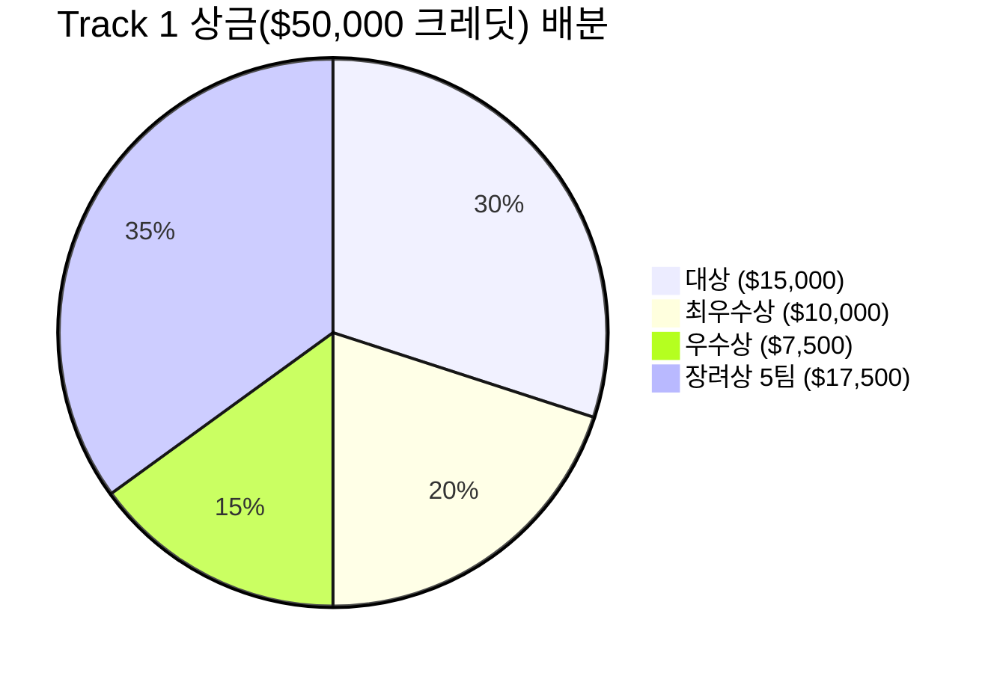

# 상금 및 리워드 (Rewards & Benefits)

OpenAI Game Builders Seoul은 우수한 AI 게임 빌더들을 격려하고, 향후 지속적인 창작과 개발을 지원하기 위해 **총 $50,000+ 상당의 OpenAI API 크레딧**과 **ChatGPT Pro 구독권**, 그리고 **모든 본선 참가자를 위한 특별 혜택**을 제공합니다.

---

## 1. 리워드 총괄표

| 트랙 구분 | 상격 | 팀 수 | 리워드 상세 내역 |
| :--- | :--- | :---: | :--- |
| **Track 1** | **대상 (Grand Prize)** | **1팀** | **$15,000 상당 OpenAI 크레딧** + **ChatGPT Pro 1년 구독권** |
| | **최우수상 (First Prize)** | **1팀** | **$10,000 상당 OpenAI 크레딧** + **ChatGPT Pro 1년 구독권** |
| | **우수상 (Second Prize)** | **1팀** | **$7,500 상당 OpenAI 크레딧** + **ChatGPT Pro 1년 구독권** |
| | **장려상 (Excellence Prize)** | **5팀** | **각 $3,500 상당 OpenAI 크레딧** (총 $17,500) + **ChatGPT Pro 1년 구독권** |
| **Track 2** | **Winner (현장 인기상)** | **3팀** | **ChatGPT Pro 1년 구독권** |
| **본선 공통** | **본선 진출자 전원** | **40팀 전원** | **$100 상당 OpenAI 크레딧** |

---

## 2. 세부 혜택 설명

### 1) OpenAI API 크레딧
- OpenAI 플랫폼에서 최신 프론티어 모델(GPT-4o, Codex, o1, Embedding, TTS, DALL·E 등) API를 호출하는 데 사용할 수 있는 공식 크레딧입니다.
- AI 기반의 차기작 개발, 백엔드 고도화, 에이전트 구축 등 다양한 창작 활동에 직접 활용할 수 있습니다.

### 2) ChatGPT Pro 1년 구독권
- OpenAI의 최고급 유료 플랜인 **ChatGPT Pro** 1년 무료 구독 권한을 부여합니다.
- 최고 성능 모델에 대한 무제한에 가까운 접근성, 가장 빠른 응답 속도, 고급 데이터 분석 및 심층 추론(Advanced Reasoning) 기능을 1년 내내 자유롭게 활용할 수 있습니다.

### 3) 본선 진출자 전원 혜택 ($100 크레딧)
- 치열한 예선을 뚫고 선발된 40개 본선 진출팀 전원에게 기본적으로 **$100 상당의 OpenAI 크레딧**이 지급됩니다.

### 4) 글로벌 사업화 및 퍼블리싱 기회 (Hive 파트너십)
- 본선 수상작 중 우수한 잠재력을 가진 프로젝트는 컴투스홀딩스의 글로벌 백엔드 플랫폼 **Hive** 연동 지원 및 향후 정식 글로벌 출시, 투자, 퍼블리싱 협력에 관한 우선 협상 기회가 주어집니다.

---

## 3. 리워드 지급 규정 및 유의사항

1. **대표자 수령**: 모든 상금(크레딧) 및 구독권은 팀 단위 신청 시 등록된 **대표자 1인의 계정/이메일로 지급**됩니다.
2. **웹 빌드 필수**: 리워드 수령을 위해서는 출품작이 브라우저에서 실행 가능한 웹 빌드 형태로 최종 검증되어야 합니다.
3. **부정행위 시 환수**: 표절, 타인 코드/에셋 무단 도용, 허위 정보 기재 등의 위반 사실이 확인될 경우 수상이 취소되고 지급된 리워드는 환수 조치됩니다.
