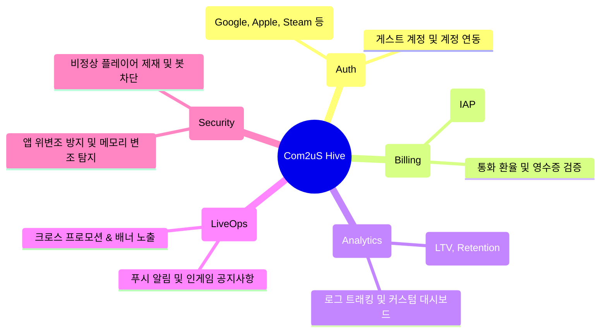

# Com2uS Hive 플랫폼 개요 및 연동 가이드

> **"Build with Codex, Play with Hive."**  
> Codex로 프로토타입을 만들고, Hive 플랫폼과 함께 글로벌 라이브 서비스로.

**Hive(하이브)**는 컴투스홀딩스(Com2uS Holdings)가 개발 및 서비스하는 글로벌 올인원 게임 백엔드 서비스(BaaS / Platform)입니다. 전 세계 1억 명 이상의 플레이어를 지원하는 대규모 게임 인프라와 운영 노하우가 집약되어 있습니다.

---

## 1. Hive 플랫폼 핵심 기능

Hive는 게임 개발자가 복잡한 서버 인프라 구축 없이 오직 게임 본연의 재미에 집중할 수 있도록 필수적인 백엔드 기능을 원스톱으로 제공합니다.

| 모듈명 | 주요 기능 및 설명 |
| :--- | :--- |
| **Hive Auth (인증)** | Google, Apple, Facebook, Steam 등 다양한 글로벌 소셜 계정 간편 연동 및 단일 계정 체계 구축 |
| **Hive Billing (결제)** | 글로벌 앱스토어 및 웹 결제 연동, 영수증 위변조 검증, 환불 처리 자동화 |
| **Hive Analytics (분석)** | 실시간 DAU, 결제율, 잔존율(Retention), 사용자 여정 분석을 통한 데이터 기반 라이브 운영 지원 |
| **Hive LiveOps (운영)** | 점검 공지, 인게임 팝업, 이벤트 배너, 글로벌 타임존 기반 스마트 푸시 발송 |
| **Hive Security (보안)** | 클라이언트 위변조 탐지, 스피드핵 및 메모리 변조 방지, 불법 프로그램 차단 |

---

## 2. 해커톤에서의 Hive 평가 관점 (Release Potential)

해커톤의 4번째 심사 기준인 **"Release Potential (서비스 확장 잠재력)"**에서 심사위원단은 출품작이 Hive 플랫폼과 결합하여 다음과 같은 발전 가능성을 지니고 있는지를 검토합니다:

1. **글로벌 유저 확장성**: 단일 로컬 환경을 넘어 글로벌 유저가 접근할 수 있는 구조인가?
2. **계정 및 저장 시스템의 유연성**: 플레이어의 진행도(세이브 데이터), 인벤토리, 레벨 데이터를 Hive 클라우드 저장소와 연계할 수 있는가?
3. **경쟁 및 소셜 기능의 접목**: Hive의 리더보드, 길드, 친구 초대 및 랭킹 시스템을 게임에 적용했을 때 리텐션이 극대화될 수 있는가?
4. **수익화 및 지속 가능성**: 인게임 아이템, 배틀패스 등 Hive 결제 시스템을 통한 비즈니스 모델(BM) 구축 가능성이 있는가?

---

## 3. 정식 서비스 전환 시 혜택

OpenAI Game Builders Seoul의 본선 진출 및 수상작 중 시장성이 검증된 프로젝트는:
- **Hive 플랫폼 기술 지원 및 무료 도입 기회 제공**
- **컴투스 그룹의 글로벌 퍼블리싱, 마케팅 및 투자 검토**
- **글로벌 런칭을 위한 기술 컨설팅 및 멘토링**

등 정식 상용화와 글로벌 스케일업을 위한 포괄적 파트너십 기회가 제공될 수 있습니다.

- **공식 사이트**: [https://hiveplatform.ai/](https://hiveplatform.ai/)
