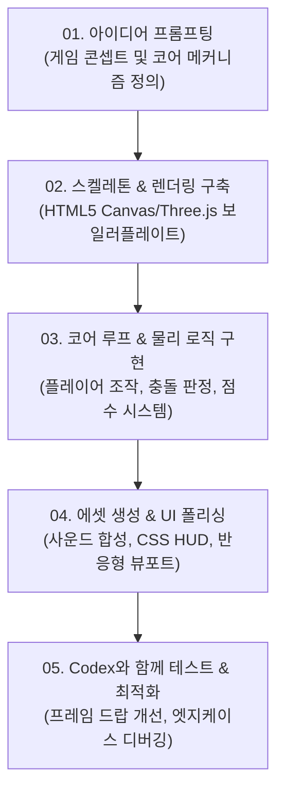

# OpenAI Codex 활용 및 AI 네이티브 개발 가이드

OpenAI Game Builders Seoul의 핵심 기술 도구인 **OpenAI Codex**의 개요, 게임 개발에서의 활용 전략 및 AI 네이티브 워크플로우 가이드입니다.

---

## 1. OpenAI Codex 개요

**Codex**는 자연어(Natural Language) 명령을 이해하고 이를 고품질 코드로 변환하거나, 기존 코드베이스를 분석·수정·디버깅하는 OpenAI의 차세대 코딩 인텔리전스 에이전트입니다.

### 핵심 역량
- **자연어-코드 변환**: "좌우로 움직이며 총알을 피하는 우주선 구현해줘"와 같은 한국어/영어 프롬프트를 완전한 게임 루프 코드로 생성
- **다중 언어 및 프레임워크 지원**: JavaScript, TypeScript, HTML5 Canvas, WebGL, WebGPU, Python, C#, Rust, Wasm 등
- **실시간 디버깅 및 리팩토링**: 렌더링 병목 지점 최적화, 물리 충돌 판정 버그 수정, 반응형 해상도 대응
- **게임 알고리즘 생성**: A* 경로 탐색, 프로시저럴 맵 생성(절차적 맵 생성), 적 AI 행동 트리(Behavior Tree) 구현

---

## 2. 해커톤에서의 Codex 협업 워크플로우



### 단계별 Codex 프롬프트 가이드

#### 1) 보일러플레이트 및 환경 설정
```text
[프롬프트 예시]
"HTML5 Canvas 2D 기반으로 모바일과 PC 웹 브라우저 양쪽에서 터치와 방향키로 조작 가능한
 단일 HTML 파일 게임 템플릿을 만들어줘. 60FPS 게임 루프와 윈도우 리사이즈 대응 코드를 포함해줘."
```

#### 2) 게임 코어 시스템 구현
```text
[프롬프트 예시]
"점프와 대시가 가능한 2D 플랫포머 캐릭터의 가속도, 중력, 충돌 박스(AABB) 처리 함수를 작성해줘.
 코드가 명확하고 모듈화되도록 GameEngine 클래스 안에 구현해줘."
```

#### 3) 적 AI 및 절차적 레벨 생성
```text
[프롬프트 예시]
"플레이어의 현재 위치를 추적하며 장애물을 피해 다가오는 간단한 상태 머신(FSM) 기반의
 몬스터 AI 로직을 추가해줘. 난이도가 시간에 따라 점진적으로 증가하도록 설계해줘."
```

#### 4) 최적화 및 크로스 브라우징
```text
[프롬프트 예시]
"현재 캔버스 렌더링 루프에서 가비지 컬렉션(GC)으로 인한 프레임 드랍이 발생하고 있어.
 객체 풀링(Object Pooling) 패턴을 적용하여 파티클 시스템을 재작성해줘."
```

---

## 3. 심사위원에게 어필하는 'Codex 활용기' 작성 팁

신청서의 선택 문항인 **"Codex와 함께 게임을 만든 과정"**은 심사에서 높은 가산점을 받을 수 있는 핵심 영역입니다. 다음 4가지 포인트를 구조화하여 작성하는 것을 권장합니다:

1. **활용 영역 (Where)**: 기획 아이데이션, 수학/물리 엔진 구현, 절차적 맵 생성, 셰이더 작성 등 어디에 Codex를 적용했는지 명시
2. **구현 기능 (What)**: 혼자서는 시간 내에 만들기 어려웠던 어떤 고난도 기능을 Codex를 통해 완성했는지 서술
3. **해결한 문제 (Problem Solving)**: 개발 중 발생한 까다로운 버그나 최적화 난제를 Codex와 대화하며 어떻게 디버깅했는지 구체적 사례 제시
4. **인간 개발자의 역할 (Human Decision)**: AI의 제안 중 무엇을 채택하고 무엇을 수정했는지, 게임의 재미와 예술적 방향성을 결정한 인간의 창의적 결단 강조
