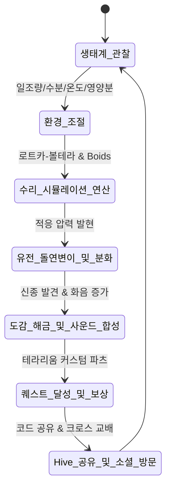

# 에코 테라리움 (Eco Terrarium: Micro Evolution) - 제품 기획서 (PRD.md)

---

## 1. 제품 개요 (Product Overview)

- **제품명**: 에코 테라리움 (Eco Terrarium: Micro Evolution) - 생태계 지휘자
- **장르**: 생태계 샌드박스 시뮬레이션 & 힐링 방치형 진화 게임
- **목표 유저**:
  1. 감성적이고 힐링되는 시각/청각적 인터랙션을 원하는 캐주얼 게이머 (고양이와 스프 팬층)
  2. 시스템 역학 및 진화 유전 알고리즘의 깊이를 탐구하는 전략/시뮬레이션 게이머 (민트로켓/스포어 팬층)
  3. 짧은 시간에 높은 완성도와 AI 기술 융합을 평가하는 해커톤 심사위원단
- **지원 환경**: 최신 웹 브라우저 (Chrome, Safari, Edge, Firefox, 모바일 iOS/Android Web)

---

## 2. 핵심 게임 메커니즘 (Core Mechanics & Gameplay Loop)



### 2.1 4대 환경 인자 (Environmental Variables)
| 환경 인자 | 조절 도구 | 시뮬레이션 영향 | 최적 범위 & 극단 현상 |
| :--- | :--- | :--- | :--- |
| **태양빛 (Sunlight)** | 상단 태양광 슬라이더 / 광선 집중 클릭 | 생산자의 광합성 속도 결정, 미세 온도 상승 | 40~70%: 균형 / 90% 이상: 녹조/백화 / 10% 이하: 식물 고사 |
| **수분 (Moisture)** | 강우 슬라이더 / 비구름 터치 (빗방울 투하) | 유체 저항, 분해자 활성화, 수생 생물 증식 | 50~80%: 최적 / 20% 이하: 가뭄 탈수 / 95% 이상: 익사 위기 |
| **온도 (Temperature)** | 열선/냉각팬 토글 및 슬라이더 (-10°C ~ 45°C) | 생체 대사량, 체력 소모 속도, 유전자 돌연변이 압력 | 18~26°C: 온대 / <0°C: 빙하기(결정화) / >38°C: 열대(돌연변이 촉진) |
| **영양소 (Nutrients)** | 유기 사료 투하 / 돌연변이 촉매제(Mutagen) | 미생물 섭식, 바닥 이끼 영양염류 농도 | 적정: 성장 가속 / 과잉: 수질 오염 및 혐기성 세균 번식 |

---

## 3. 16종 생물 도감 및 진화 계통도 (Species & Evolution Tree)

```mermaid
graph TD
    subgraph Tier1 [생산자 (Producers)]
        T1_1["🌿 루미 플로라<br/>(기본 발광 조류)"] -->|일조량 > 80%| T1_2["☀️ 솔라 블룸<br/>(광합성 거대 꽃)"]
        T1_1 -->|수분 > 85%| T1_3["🌊 아쿠아 켈프<br/>(수생 부유 해초)"]
        T1_1 -->|온도 < 5°C| T1_4["❄️ 크리스탈 리프<br/>(빙결 수정 식물)"]
    end

    subgraph Tier2 [1차 소비자 / 초식 (Herbivores)]
        T2_1["🫧 젤리 위글<br/>(말랑 초식 플랑크톤)"] -->|속도 유전 변이| T2_2["✨ 글로우 테일<br/>(발광 유영체)"]
        T2_1 -->|방어 유전 변이| T2_3["🛡️ 쉘 포드<br/>(보호막 완보생물)"]
        T2_1 -->|온도 > 35°C + 촉매| T2_4["🌈 오로라 핀<br/>(희귀 무지개 생물)"]
    end

    subgraph Tier3 [2차/최상위 포식자 (Predators)]
        T3_1["👁️ 팬텀 립<br/>(부유 사냥 미생물)"] -->|공격성 유전 변이| T3_2["⚡ 스파이크 헌터<br/>(돌진형 가시 포식자)"]
        T3_1 -->|4단계 공존 120초| T3_3["🐙 네뷸라 크라켄<br/>(전설의 성운 크라켄)"]
    end

    subgraph Tier4 [분해자 & 공생자 (Decomposers)]
        T4_1["🍄 미셀 링커<br/>(사체 분해 균사체)"] -->|산소 정화 특화| T4_2["🔮 바이오 정제기<br/>(정화 발광 구체)"]
        T4_1 -->|희귀 돌연변이| T4_3["🌌 에테르 스포어<br/>(영혼 순환 포자)"]
    end

    T1_1 -.먹이.-> T2_1
    T2_1 -.먹이.-> T3_1
    T3_1 -.사체/노폐물.-> T4_1
    T4_1 -.유기 영양분.-> T1_1
```

### 3.1 생물 상세 명세
1. **루미 플로라 (Lumi Flora)**: 연두빛으로 반짝이는 기본 미생물 식물. 태양빛을 받으면 포자를 방출함.
2. **솔라 블룸 (Solar Bloom)**: 강한 햇빛 아래서만 개화하며 거대한 에너지 펄스를 방출하는 희귀 식물.
3. **아쿠아 켈프 (Aqua Kelp)**: 높은 습도에서 물결치며 수생 생물들에게 은신처를 제공함.
4. **크리스탈 리프 (Crystal Leaf)**: 영하의 온도에서 푸른 얼음 결정 형태로 번식하는 극지 생물.
5. **젤리 위글 (Jelly Wiggle)**: 파스텔 핑크빛의 말랑말랑한 젤리형 생물. 통통 튀며 식물을 섭취.
6. **글로우 테일 (Glow Tail)**: 꼬리에서 반짝이는 별가루 입자를 흘리며 빠르게 헤엄치는 미생물.
7. **쉘 포드 (Shell Pod)**: 거북이 같은 반투명 등껍질로 포식자의 공격을 1회 방어.
8. **오로라 핀 (Aurora Fin)**: 무지개빛 오로라 지느러미를 가진 희귀 생물. 주변 생물의 행복도를 높임.
9. **팬텀 립 (Phantom Lip)**: 보라빛 반투명 몸체통으로 초식 생물을 포획하는 포식자.
10. **스파이크 헌터 (Spike Hunter)**: 황금빛 뿔과 가시로 무장하여 빠른 대시 공격을 구사하는 상위 포식자.
11. **네뷸라 크라켄 (Nebula Kraken)**: 밤하늘 은하수를 닮은 전설의 미니 크라켄. 테라리움의 수호자.
12. **미셀 링커 (Mycel Linker)**: 바닥 토양에 버섯 모양 균사를 뻗어 사체를 영양분으로 환원.
13. **바이오 정제기 (Bio Purifier)**: 유독 가스를 정화하여 산소 버블을 퐁퐁 터뜨리는 힐링 구체.
14. **에테르 스포어 (Aether Spore)**: 환상적인 청록빛 포자를 흩뿌리며 다음 세대의 진화를 촉진하는 전설 균류.
15. **코스믹 플랑크톤 (Cosmic Plankton)**: 4종 생태계가 완벽한 조화를 이룰 때 출현하는 별빛 생물.
16. **프리즘 아메바 (Prism Amoeba)**: 주변 빛과 환경에 따라 몸 색깔이 실시간으로 변하는 카멜레온 아메바.

---

## 4. 수리적 시뮬레이션 및 유전 알고리즘 수식 (Mathematical Engine)

### 4.1 확장 로트카-볼테라 (Extended Lotka-Volterra with Environmental Modulation)
생산자 $P$, 초식 소비자 $C$, 포식자 $H$, 분해자 $D$, 영양염류 $N$:

$$\frac{dN}{dt} = \kappa \cdot D - \alpha_N \cdot P \cdot N + \text{Input}_{Nutrient}$$

$$\frac{dP}{dt} = r(S, M, T) \cdot P \cdot \left(1 - \frac{P}{K(N)}\right) - \beta \cdot P \cdot C$$

$$\frac{dC}{dt} = \epsilon_C \cdot \beta \cdot P \cdot C - \gamma \cdot C \cdot H - \mu_C(T) \cdot C$$

$$\frac{dH}{dt} = \epsilon_H \cdot \gamma \cdot C \cdot H - \mu_H(T) \cdot H$$

$$\frac{dD}{dt} = \delta \cdot (\text{Corpses}) - \mu_D \cdot D$$

여기서 환경 함수 $r(S, M, T)$는 가우시안 최적 곡선으로 정의:
$$r(S, M, T) = r_{max} \cdot \left(\frac{S}{100}\right) \cdot \left(\frac{M}{100}\right) \cdot \exp\left(-\frac{(T - T_{opt})^2}{2\sigma_T^2}\right)$$

### 4.2 개체 유전 벡터 (Genome Vector) & 돌연변이
각 개체 $i$는 10차원 유전자 벡터 $\mathbf{g}_i = [g_{size}, g_{speed}, g_{metabolism}, g_{tempOpt}, g_{tempTol}, g_{moistOpt}, g_{hue}, g_{mutationRate}, g_{defense}, g_{biolum}]$를 지님.  
($g_{tempTol}$은 최적 온도로부터의 허용 오차, $g_{biolum}$은 생체 발광 밝기. 구현은 `src/shared/kernel/types.ts`의 `Genome` 인터페이스를 단일 기준으로 한다.)  
자손 생성 시:
$$\mathbf{g}_{child} = \mathbf{g}_{parent} + \mathcal{N}(0, \sigma^2) + \mathbf{P}_{env}$$
환경 압력 벡터 $\mathbf{P}_{env}$에 의해 현재 온도가 높으면 고온 적응 방향으로 드리프트(Drift) 발생.

---

## 5. 절차적 오디오 시스템 아키텍처 (Web Audio Generative Engine)

1. **오디오 안전성**: AudioContext는 브라우저 정책에 따라 사용자 첫 클릭/터치 시 부드럽게 Resume.
2. **화음 구조 (Harmonic Palette)**:
   - C Major / A Pentatonic (C4, D4, E4, G4, A4, C5, D5, E5, G5, A5)
   - 생태계 조화도(Harmony Index)가 높을수록 9th, 11th 텐션 및 리디안(Lydian) 모드로 발전하여 풍성한 천상의 사운드 연출.
3. **신스 레이어 구성**:
   - **Layer 1 (Ambient Drone/Pad)**: 듀얼 오실레이터(Sine + Triangle) + LFO 필터 스윕으로 따뜻한 공간감 부여.
   - **Layer 2 (Bio-Chimes)**: 생물 행동(식사, 분열, 진화) 시 ADSR 엔벨로프가 적용된 청아한 실로폰/글록켄슈필 톤 핑.
   - **Layer 3 (Nature Foley)**:
     - 빗소리: 핑크 노이즈 밴드패스 필터링 + 랜덤 빗방울 클릭.
     - 햇살: 부드러운 고주파 쉬머(Shimmer) 하모닉스.
     - 유리병 탭: 2200Hz 댐핑 벨 사운드.

---

## 6. Com2uS Hive 연동 및 소셜 기능 사양

### 6.1 테라리움 공유 코드 (Ecosystem DNA Code)
- 테라리움의 환경 슬라이더, 생물 종 개체수, 대표 유전자 풀, 커스텀 병 스킨 ID를 JSON 구조화 후 lz-string으로 URI-safe 압축 후 `ECO-XXXX-XX` 형식 단축 코드로 변환.
- URL 쿼리 파라미터(`?dna=...`, 별칭 `?code=...`) 링크를 통해 원클릭으로 타 유저의 테라리움으로 접속 가능.
- 별도로 브라우저 `localStorage`에 진행 중인 테라리움과 퀘스트 달성 현황을 자동 저장하여 새로고침·재방문 시 복원. 공유 링크가 있으면 링크가 자동 저장본보다 우선한다.

### 6.2 방문 모드 (Visitor Sandbox)
- 타인의 테라리움 방문 시 "방문자 모드 UI" 활성화.
- **꽃가루 뿌리기**: 하루 3회 방문 테라리움에 영양 버프 부여.
- **포자 채집**: 상대방 테라리움의 희귀 생물 포자를 채집하여 내 테라리움에 입식 및 교배(Cross-breeding).

### 6.3 리더보드 (Global Eco Ranking)
- 3개 부문 랭킹 지원:
  1. 최고 생태계 수호 시간 (Survival Time)
  2. 생물 도감 해금 수 (Discovered Species)
  3. 바이오 하모니 지수 (Max Harmony Score)

---

## 7. 심사위원 전용 퀵 쇼케이스 & Codex 스토리

### 7.1 Judge Quick Showcase Bar
- **[⚡ 즉시 번영 모드]**: 4대 트로픽 레벨이 완벽히 조화된 만개한 테라리움 상태 즉시 로드.
- **[🔥 돌연변이 가속]**: 영양제 및 온도 촉매를 주입하여 5초 내에 신종 진화 연출.
- **[❄️ 빙하기 위기 탈출]**: -5°C 빙하기에서 크리스탈 리프와 저온 생물들의 생존 드라마 연출.
- **[🎵 오케스트라 사운드]**: 모든 바이오 화음 레이어가 풀 오케스트레이션으로 울려 퍼지는 오디오 테스트.

### 7.2 Codex AI 네이티브 개발기 모달
- OpenAI Codex와 협업하여 수립한 미분방정식 수치해석 코드, Web Audio 모듈, 파티클 최적화 기법에 대한 다이어그램과 프롬프트-코드 변환 과정 팝업 제공.
