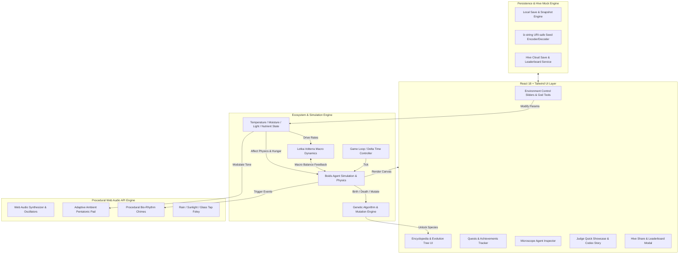

# 에코 테라리움 (Eco Terrarium: Micro Evolution) - 상세 요구사항 정의서 (REQUIREMENTS.md)

**프로젝트명**: 에코 테라리움 (Micro Evolution: 생태계 지휘자)  
**장르**: 생태계 샌드박스 시뮬레이션 & 힐링 방치형 진화 게임 (Ecosystem Sandbox & Evolution Simulation)  
**플랫폼**: 최신 웹 브라우저 (PC & Mobile 반응형 완벽 지원, HTML5 Canvas 2D/WebGL + Web Audio API + React/TypeScript)  
**대회**: OpenAI Game Builders Seoul Hackathon  

---

## 1. 프로젝트 개요 및 비전

### 1.1 슬로건
> *"빛, 수분, 온도를 조절하여 작은 유리병 속 가상 생물들의 진화와 균형을 지켜내는 힐링 생태계 시뮬레이션"*

### 1.2 핵심 가치
1. **수리적 생태계 시뮬레이션의 깊이 (민트로켓 김대훤 심사위원 타깃)**: 로트카-볼테라(Lotka-Volterra) 연립 미분방정식과 개체 기반 유전 진화 알고리즘(Individual-Based Genetic Algorithm)의 융합.
2. **서정적 힐링 감성과 1인 개발 완성도 (고양이와 스프 김동규 심사위원 타깃)**: 부드러운 파스텔 톤 유리병 비주얼, 생물들의 유기적인 꿈틀거림, 절차적 생성 화음 앰비언트 BGM.
3. **OpenAI Codex AI 네이티브 협업 (Codex 심사 기준 타깃)**: 복잡한 비선형 미분방정식 수치해석, Boids 무리 행동, Web Audio 신디사이저, 동적 도감 시스템의 고도화 구현.
4. **Com2uS Hive 연동 및 글로벌 라이브 서비스 잠재력 (Hive 심사 기준 타깃)**: 테라리움 생태계 DNA 단축 코드 공유, 가상 방문 및 크로스 수분(교배), 글로벌 생태 지수 리더보드.

---

## 2. 기능적 요구사항 (Functional Requirements)

### 2.1 생태계 환경 조작 시스템 (Player God Controls)
- **FR-ENV-01: 일조량(Sunlight / UV) 조절**
  - 범위: 0% ~ 100% (슬라이더 및 실시간 광선 클릭/드래그).
  - 영향: 생산자(식물/조류)의 광합성 속도 증가, 병 내부 온도 상승 유발, 광과민성 생물 행동 변화.
  - 시각 효과: 화면 상단 갓레이(God rays), 유리 표면 반사광, 식물 생체발광 강도 변화.
- **FR-ENV-02: 수분 및 강우(Moisture / Rainmaker) 조절**
  - 범위: 0% ~ 100% (슬라이더 및 구름 터치 시 빗방울 투하).
  - 영향: 토양 및 공기 중 수분량 증가, 수생 생물 이동속도 및 분해자 활동 촉진, 과습 시 곰팡이/이끼 번성.
  - 시각 효과: 유리벽 물방울 맺힘 및 흘러내림, 바닥 파문(Ripple) 이펙트.
- **FR-ENV-03: 온도(Temperature / Thermal Regulator) 조절**
  - 범위: -10°C (빙하기) ~ 45°C (화산 온난기). 기본 22°C.
  - 영향: 생물별 최적 생존 온도(Temperature Tolerance) 이탈 시 체력 감소 및 저온/고온 내성 돌연변이 발현 유도.
  - 시각 효과: 저온 시 유리병 성에/얼음 결정, 고온 시 아지랑이 및 증기 파티클.
- **FR-ENV-04: 영양소 & 촉매 투하 (Nutrient / Mutagen Dropper)**
  - 기능: 마우스/터치로 유리병 내부 원하는 지점에 유기물 사료(Nutrient) 또는 돌연변이 촉매제(Mutagen) 투하.
  - 반응: 주변 생물들이 사료를 향해 이동(Attractive Vector), 촉매제 섭취 시 다음 세대 돌연변이 확률 3배 증가.
- **FR-ENV-05: 유리병 두드리기 인터랙션 (Glass Tap Interaction)**
  - 기능: 유리병 클릭/탭 시 파동(Shockwave) 발생, 가까운 미생물들이 깜짝 놀라 흩어졌다가 다시 모임.

### 2.2 하이브리드 생태계 시뮬레이션 엔진 (Simulation Dynamics)
- **FR-SIM-01: 4단계 먹이사슬 트로픽 레벨(Trophic Levels)**
  1. **생산자 (Producers / Flora)**: 빛과 이산화탄소, 영양분을 흡수하여 증식. 포식자의 먹이가 됨.
  2. **1차 소비자 / 초식 (Primary Consumers / Herbivores)**: 식물성 미생물을 섭취하여 에너지 충전, 배설물을 배출하여 토양 영양분 환원.
  3. **2차/최상위 포식자 (Secondary / Apex Predators)**: 초식 생물을 추적 사냥. 개체수가 과도해지면 먹이 고갈로 자멸 위험.
  4. **분해자 (Decomposers / Mycelium)**: 생물의 사체(Carcase)와 노폐물을 유기 영양염류로 분해하여 생산자의 거름으로 순환.
- **FR-SIM-02: 개체 기반 Boids 및 생명 주기 (Individual Agent Life-cycle)**
  - 개체 상태: `HP/Energy`, `Hunger`, `Age/Lifespan`, `ReproductionCooldown`, `State(Wandering, Foraging, Fleeing, Mating, Dying)`.
  - 물리 운동: 점성 유체 저항, 유리병 경계 충돌 반사, 무리 짓기(Boids: Separation, Alignment, Cohesion).
  - 번식: 에너지가 일정 수준 이상이고 짝을 만나거나(유성) 분열 조건(무성) 만족 시 자손 생성.
- **FR-SIM-03: 유전 돌연변이 및 진화 시스템 (Genetic Mutation & Speciation)**
  - 유전자(Genome) 속성 10종: 크기(size), 속도(speed), 대사 효율(metabolism), 최적 온도(tempOpt), 온도 허용 오차(tempTol), 최적 수분(moistOpt), 체색(hue), 돌연변이율(mutationRate), 방어력(defense), 생체 발광(bioluminescence). 구현 기준은 `src/shared/kernel/types.ts`의 `Genome` 인터페이스.
  - 번식 시 부모의 유전자에 가우시안 노이즈(Gaussian Noise) 및 환경 압력(Environmental Pressure)에 따른 지향성 돌연변이 적용.
  - 특정 유전자 임계치 및 환경 조건 달성 시 **신종(New Species)으로 분화(Speciation)** 및 도감 등록.

### 2.3 생물 도감 및 진화 트리 (Encyclopedia & Species Discovery)
- **FR-BIO-01: 15종 이상의 독창적인 생물 도감**
  - 각 생물별 학명, 귀여운 일러스트/실시간 렌더링 프리뷰, 설명, 서식 환경 조건, 수집 보상.
  - 미발견 생물은 실루엣과 힌트로 표시(예: "온도가 38도 이상일 때 생산자에게서 분화").
- **FR-BIO-02: 실시간 개체 관찰 모드 (Microscope Inspector)**
  - 유리병 속 임의의 생물을 클릭하면 돋보기 포커싱 UI 팝업.
  - 생물의 이름(직접 변경 가능), 나이, 유전자 세부 수치, 세대(Generation), 먹이 섭취 기록 표시.

### 2.4 Web Audio API 기반 절차적 바이오 사운드스케이프 (Generative Audio)
- **FR-AUD-01: 적응형 앰비언트 코드 패드 (Generative Harmony Engine)**
  - 생태계 전체 균형도(Ecosystem Health)와 주/야간 주기에 따라 펜타토닉/리디안 코드 진행이 부드럽게 전환.
- **FR-AUD-02: 바이오 리듬 아르페지오 (Creature Chimes)**
  - 미생물이 탄생, 섭식, 돌연변이 진화할 때 고유 주파수의 맑은 챠임(Chime)/벨 톤이 음악적 템포에 맞춰 조화롭게 합성 출력.
- **FR-AUD-03: 절차적 환경 폴리 사운드 (Procedural Foley)**
  - 빗소리(White noise bandpass filter + random click drops), 햇살 앰비언스, 유리병 탭 틴더 사운드.
  - 오디오 On/Off 및 볼륨 슬라이더 제공.

### 2.5 퀘스트, 업적 및 테라리움 커스터마이징 (Progression & Quests)
- **FR-PROG-01: 생태계 지휘자 퀘스트 (Missions)**
  - 10개 이상의 튜토리얼 및 챌린지 퀘스트 (예: "3종 생태계 60초 유지", "빙하기에서 저온 내성종 탄생시키기" 등).
  - 퀘스트 클리어 시 테라리움 커스텀 파츠 및 특수 시약 해금.
- **FR-PROG-02: 테라리움 커스터마이징 (Customization)**
  - 유리병 디자인 (클래식 보틀, 다이아몬드 지오메트릭 돔, 마법 플라스크, 미니 아쿠아리움).
  - 바닥 토양 테마 (이끼 숲, 신비의 심해, 화산 흑요석, 수정 동굴).
  - 배경 테마 (아늑한 연구실 서재, 새벽 숲, 석양의 창가, 별빛 우주).
- **FR-PROG-03: 타임랩스 및 사진 모드 (Photo & Speed Controls)**
  - 0.5x, 1x, 2x, 5x 배속 및 일시정지 지원.
  - 포토 모드: 필터(빈티지, 네온, 수채화), 워터마크가 포함된 스냅샷 이미지 다운로드.

### 2.6 Hive 소셜 연동 및 데이터 저장 (Hive Integration & Sharing)
- **FR-HIVE-01: 생태계 DNA 단축 코드 생성 및 공유 (Ecosystem Seed Sharing)**
  - 현재 테라리움의 환경, 생물 분포, 유전자 풀을 lz-string 압축(`compressToEncodedURIComponent`)으로 URI-safe 문자열 인코딩 후 `ECO-XXXX-XX` 형식 단축 코드 및 딥링크 생성.
  - 클립보드 복사 및 URL 파라미터(`?dna=...`, 하위 호환 별칭 `?code=...`)를 통한 즉시 불러오기 지원.
- **FR-HIVE-02: 가상 테라리움 방문 모드 (Visitor Mode)**
  - 다른 플레이어의 코드를 입력하면 해당 플레이어의 테라리움으로 이동하여 관람.
  - "꽃가루 선물하기"로 영양분 지원 및 "포자 채집"으로 내 테라리움에 교배용 외래종 입식.
- **FR-HIVE-03: 글로벌 생태 랭킹 리더보드 (Hive Leaderboards)**
  - "최장 생태계 지속 시간", "도감 해금율", "최고 바이오 하모니 지수" 랭킹 시뮬레이션 및 등록.
  - 현 빌드의 랭킹 데이터는 로컬 목업(`HiveShareModal.tsx`의 `MOCK_LEADERBOARD_STATS` + i18n 카탈로그 문구)이며 실제 Hive SDK는 연동되어 있지 않다.
- **FR-HIVE-04: 로컬 자동 저장 및 복원 (Local Autosave)**
  - 게임 시작 이후 10초 주기 및 탭 이탈(`visibilitychange` / `pagehide`) 시 현재 테라리움과 퀘스트 달성 현황을 `localStorage`에 압축 저장.
  - 재방문 시 자동 복원. 공유 딥링크가 있으면 딥링크가 자동 저장본보다 우선한다.
  - 저장소를 쓸 수 없거나(사파리 프라이빗 모드, 용량 초과) 저장본이 손상된 경우 예외를 던지지 않고 조용히 실패하며, 손상된 저장본은 폐기하여 게임이 로드 실패로 고착되지 않도록 한다.
  - 플레이 가이드 모달에서 확인 절차를 거친 뒤 테라리움을 초기화할 수 있다. 초기화 시 저장본 폐기, 생태계 재시드, 도감 해금 및 퀘스트 기록 초기화가 함께 이루어진다.
- **FR-HIVE-05: 현장 시연용 QR 코드 공유 (Stage QR Handoff)**
  - 화면에 상시 배지와 전용 모달로 QR을 노출해, 관객·심사위원이 폰으로 즉시 플레이에 진입할 수 있도록 한다.
  - QR이 가리키는 주소는 항상 관객 폰에서 열리는 주소여야 한다. 현재 페이지가 `localhost`·`127.0.0.1`·`0.0.0.0`·`[::1]`이거나, `file:` 등 HTTP(S)가 아닌 스킴이거나, 주소를 얻을 수 없으면 공개 주소(`PUBLIC_PLAY_URL`)로 폴백한다.
  - 실제 공개 주소일 때는 origin과 경로만 남기고 쿼리 문자열을 제거한다. 시연 중 붙은 파라미터가 QR에 섞이지 않는다.
  - 현재 보고 있는 언어를 `?lang=`으로 전달해 폰에서도 같은 언어로 열린다. 배지와 모달은 같은 주소를 가리킨다.
  - 오류 정정 수준은 H를 사용한다. 무대 조명·촬영 각도·낮은 프로젝터 대비에서의 인식률을 코드 밀도보다 우선한다.
  - QR 생성은 브라우저 API에 의존하지 않는 순수 계산으로 수행하며, 콰이어트 존을 포함한 정방 행렬과 SVG 경로를 산출한다.

> FR-HIVE-05는 구현·테스트가 먼저 존재하던 기능을 출하된 동작 그대로 기술한 사후 요구사항이다. 근거는 `src/features/hive/domain/qrCode.ts`와 `src/test/qrCode.test.ts`다.

### 2.7 심사위원 전용 퀵 투어 & AI 개발 스토리 모달 (Hackathon Showcase)
- **FR-JUDGE-01: 심사위원 원클릭 퀵 쇼케이스 (Judge Quick Showcase)**
  - 3분 피칭 및 평가를 위해 "즉시 번영 프리셋", "돌연변이 폭발 프리셋", "빙하기 위기 탈출 프리셋" 원클릭 로드 버튼 제공.
- **FR-JUDGE-02: Codex AI 네이티브 개발기 모달 (AI Collaboration Story)**
  - Lotka-Volterra 미분방정식 구현 과정, Web Audio 합성기 설계, Boids 최적화 등에 대한 Codex 협업 프롬프트 및 아키텍처 다이어그램 인게임 열람.

---

## 3. 비기능적 요구사항 (Non-Functional Requirements)

### 3.1 성능 및 호환성 (Performance & Compatibility)
- **NFR-PERF-01**: 100개 이상의 미생물 개체 및 300개 이상의 파티클 렌더링 시 데스크톱/모바일 기준 60 FPS 유지.
- **NFR-PERF-02**: 가비지 컬렉션(GC) 스파이크 방지를 위해 파티클 및 엔티티 객체 풀링(Object Pooling) 구조 적용.
- **NFR-PERF-03**: 반응형 웹 디자인(Responsive UI) 지원 (320px 모바일 화면부터 4K 모니터까지 완벽 뷰포트 스케일링).
- **NFR-PERF-04**: 번들 용량 최소화 및 오프라인 단일 로딩 가능 (외부 대용량 에셋 의존 없이 SVG/Canvas/WebAudio 프로시저럴 생성).

### 3.2 접근성 및 사운드 안전성 (UX & Audio Safety)
- **NFR-UX-01**: 오디오 자동 재생 정책(Browser Autoplay Policy) 준수 (첫 사용자 상호작용 후 AudioContext Resume).
- **NFR-UX-02**: 직관적인 툴팁 및 온보딩 가이드라인 제공.
- **NFR-UX-03**: 저시력자/색약자를 고려한 명도 대비 및 색상 외 형태/아이콘 기반 상태 구분.

---

## 4. 시스템 아키텍처 및 데이터 흐름

